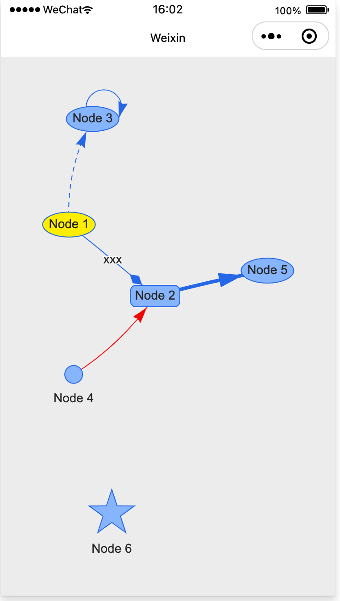

# vis-network-ma
小程序集成[vis-network](https://github.com/visjs/vis-network)网络图可视化组件，集成可参考[过程](./miniprogram/lib/README.wx.refactor.md)。

## 编译运行
- 准备
  - 安装Node
  - 安装微信开发者工具
- 打开微信开发者工具
- 终端 > + ，执行npm依赖安装
  ```
  npm install
  ```
  - 安装后生成node_mudules/
- 工具 > 构建npm
  - 构建后生成miniprogram/miniprogram_npm/
- crypto替换
  - 全文搜索 "crypto" 替换成 "crypto-js"
- 编译即可运行，界面展示  
  
- 注意
  - 开发者工具MacOS上未必支持双指操作，请手机上验证

# License版权

vis-network-ma 版权基于：  
The Apache 2.0 License http://www.apache.org/licenses/LICENSE-2.0

您可自由使用vis-network-ma，请注明版权和开发者信息。

使用问题可与我联系。